# BowlTrack — Database Schema

This document is the canonical reference for the Postgres schema (Supabase
public schema) as of migration `20260101000010_v10_pot_formulas.sql`.

It is the input you'd feed to an AI assistant to design new screens / flows.
It pairs with `DOMAIN.md` (what these tables mean in bowling terms) and
`PAGES.md` (where each table surfaces in the UI).

## Entity-relationship diagram

```mermaid
erDiagram
    AUTH_USERS ||--o{ ASSOCIATIONS : "creates"
    AUTH_USERS ||--o{ LEAGUES : "creates"
    AUTH_USERS ||--o{ EVENTS : "creates"
    AUTH_USERS ||--o{ PLAYERS : "creates"
    AUTH_USERS ||--o{ SCORE_EDITS : "edited_by"

    ASSOCIATIONS ||--o{ LEAGUES : "umbrella"
    LEAGUES     ||--o{ SEASONS : "has"
    LEAGUES     ||--o{ LEAGUE_MEMBERSHIPS : "rosters"
    LEAGUES     ||--o{ EVENTS : "hosts"
    SEASONS     ||--o{ LEAGUE_MEMBERSHIPS : "scopes"
    SEASONS     ||--o{ EVENTS : "groups"
    PLAYERS     ||--o{ LEAGUE_MEMBERSHIPS : "joins"
    PLAYERS     ||--o{ EVENT_PLAYERS : "registers as"
    EVENTS      ||--o{ EVENT_PLAYERS : "rosters"
    EVENTS      ||--o{ GAMES : "contains"
    EVENTS      ||--o{ POT_GAMES : "side games"
    EVENTS      ||--o{ EVENT_LANE_ASSIGNMENTS : "lane plan"
    EVENT_PLAYERS ||--o{ GAMES : "bowls"
    EVENT_PLAYERS ||--o{ EVENT_LANE_ASSIGNMENTS : "assigned"
    EVENT_PLAYERS ||--o{ POT_GAME_ENTRIES : "buys in"
    GAMES       ||--o{ FRAMES : "10 frames"
    GAMES       ||--o{ SCORE_EDITS : "audit"
    FRAMES      ||--o{ SCORE_EDITS : "frame edit"
    POT_GAMES   ||--o{ POT_GAME_ENTRIES : "entrants"

    ASSOCIATIONS {
        uuid id PK
        text name
        text acronym
        text image_url
        text description
        text public_slug UK
        uuid created_by FK
    }
    LEAGUES {
        uuid id PK
        text name
        text acronym
        uuid association_id FK
        text center_name
        smallint day_of_week
        time start_time_local
        text timezone
        text description
        text logo_url
        text banner_url
        text public_slug UK
        smallint hdcp_base
        numeric hdcp_factor
        smallint hdcp_min
        smallint hdcp_max
        uuid created_by FK
    }
    SEASONS {
        uuid id PK
        uuid league_id FK
        text name
        date start_date
        date end_date
        text status
    }
    LEAGUE_MEMBERSHIPS {
        uuid id PK
        uuid league_id FK
        uuid player_id FK
        uuid season_id FK
        text status
        text season_label
        timestamptz joined_at
    }
    PLAYERS {
        uuid id PK
        text full_name
        text affiliation
        text avatar_url
        text handedness
        numeric home_average
        text public_slug UK
        uuid created_by FK
    }
    EVENTS {
        uuid id PK
        text name
        text type
        date start_date
        time start_time
        date end_date
        text status
        text public_slug UK
        text center_name
        smallint total_games
        smallint hdcp_base
        numeric hdcp_factor
        smallint hdcp_min
        smallint hdcp_max
        uuid league_id FK
        uuid season_id FK
        uuid created_by FK
    }
    EVENT_PLAYERS {
        uuid id PK
        uuid event_id FK
        uuid player_id FK
        smallint handicap
        smallint lane_number
        boolean is_playing
        timestamptz entry_date
    }
    EVENT_LANE_ASSIGNMENTS {
        uuid id PK
        uuid event_id FK
        uuid event_player_id FK
        smallint lane_number
    }
    GAMES {
        uuid id PK
        uuid event_id FK
        uuid event_player_id FK
        smallint game_number
        date played_on
        smallint total_score
        boolean is_complete
    }
    FRAMES {
        uuid id PK
        uuid game_id FK
        smallint frame_number
        smallint roll_1
        smallint roll_2
        smallint roll_3
        smallint frame_score
    }
    SCORE_EDITS {
        uuid id PK
        uuid game_id FK
        uuid frame_id FK
        uuid edited_by FK
        text field
        text old_value
        text new_value
    }
    POT_GAMES {
        uuid id PK
        uuid event_id FK
        text type
        text name
        smallint game_number
        text formula
        numeric factor
        smallint hdcp_min
        smallint hdcp_max
        smallint ceiling
    }
    POT_GAME_ENTRIES {
        uuid id PK
        uuid pot_game_id FK
        uuid event_player_id FK
        uuid partner_event_player_id FK
    }
```



## Tables

### `associations`

Umbrella organizations that leagues affiliate with (e.g., MTBA, CBA).

| Column        | Type        | Notes                                    |
| ------------- | ----------- | ---------------------------------------- |
| `id`          | uuid PK     | gen_random_uuid()                        |
| `name`        | text        | "Manila Tenpin Bowlers Association"      |
| `acronym`     | text        | "MTBA"                                   |
| `image_url`   | text        | Logo URL (Supabase Storage)              |
| `description` | text        | Long-form copy for the public profile    |
| `public_slug` | text UK     | Random short code for `/associations/:s` |
| `created_by`  | uuid FK     | → `auth.users.id`                        |
| timestamps    |             | `created_at`, `updated_at`               |

### `leagues`

A specific league/league night (e.g., MTBA-Remate, MTBA-Valiant). Independent
leagues can exist without an association.

| Column             | Type           | Notes                                       |
| ------------------ | -------------- | ------------------------------------------- |
| `id`               | uuid PK        |                                             |
| `name`             | text           | "MTBA-Remate Night League"                  |
| `acronym`          | text           | "MTBA-Remate"                               |
| `association_id`   | uuid FK NULL   | → `associations.id` (`ON DELETE SET NULL`)  |
| `parent_league_id` | uuid FK NULL   | Legacy from v3 — **unused in UI**           |
| `center_name`      | text           | "Playdium Bowling Center"                   |
| `day_of_week`      | smallint NULL  | 0=Sun..6=Sat                                |
| `start_time_local` | time NULL      | `20:30:00` for "Wednesdays 8:30 PM"         |
| `timezone`         | text default `'Asia/Manila'` | IANA name                     |
| `description`      | text           | Long-form copy                              |
| `logo_url`         | text           | Square logo (Supabase Storage)              |
| `banner_url`       | text           | Wide banner                                 |
| `public_slug`      | text UK        | `/leagues/:slug`                            |
| `hdcp_base`        | smallint       | Default 200                                 |
| `hdcp_factor`      | numeric(4,2)   | Default 0.80                                |
| `hdcp_min`         | smallint       | Default 0                                   |
| `hdcp_max`         | smallint       | Default 80                                  |
| `created_by`       | uuid FK        |                                             |

Constraints: `hdcp_factor in [0..2]`, `hdcp_min ≥ 0`, `hdcp_max ≥ hdcp_min`,
`parent_league_id ≠ id`.

### `seasons`

One row per season cycle within a league (e.g., "2026 S1").

| Column       | Type         | Notes                                   |
| ------------ | ------------ | --------------------------------------- |
| `id`         | uuid PK      |                                         |
| `league_id`  | uuid FK      | → `leagues.id` (`ON DELETE CASCADE`)    |
| `name`       | text         | "2026 S1"                               |
| `start_date` | date NULL    |                                         |
| `end_date`   | date NULL    |                                         |
| `status`     | text         | `'upcoming' \| 'active' \| 'completed'` |
| timestamps   |              |                                         |

Unique: `(league_id, name)`.

### `league_memberships`

Who is registered to a league for a given season, and as Regular vs Guest.

| Column         | Type    | Notes                                    |
| -------------- | ------- | ---------------------------------------- |
| `id`           | uuid PK |                                          |
| `league_id`    | uuid FK | → `leagues.id`                           |
| `player_id`    | uuid FK | → `players.id`                           |
| `season_id`    | uuid FK NULL | → `seasons.id` (preferred lookup)   |
| `status`       | text    | `'regular' \| 'guest'`                   |
| `season_label` | text    | Legacy denormalized cache; UI ignores it |
| `joined_at`    | timestamptz |                                      |

Unique: `(league_id, player_id, season_id)`.

### `players`

A bowler. Globally addressable by `public_slug`. Owned by the admin who first
created the row (`created_by`).

| Column         | Type            | Notes                                   |
| -------------- | --------------- | --------------------------------------- |
| `id`           | uuid PK         |                                         |
| `full_name`    | text            |                                         |
| `affiliation`  | text NULL       | Free-text club / association tag        |
| `avatar_url`   | text NULL       | Optional                                |
| `handedness`   | text NULL       | `'left' \| 'right' \| 'ambi'`           |
| `home_average` | numeric(5,2) NULL | Used by handicap recompute            |
| `public_slug`  | text UK         | "anton-reyes-7af3c2"                    |
| `created_by`   | uuid FK         |                                         |

### `events`

An actual bowling night. For leagues this is "Week 1", for tournaments it's the
whole event. After v8 there are no sub-sessions — one event = one bowling
night.

| Column        | Type           | Notes                                          |
| ------------- | -------------- | ---------------------------------------------- |
| `id`          | uuid PK        |                                                |
| `name`        | text           | "Week 1" / "Mixed Masters Finals"              |
| `type`        | text           | `'league' \| 'tournament'`                     |
| `start_date`  | date           |                                                |
| `start_time`  | time NULL      | "20:30:00" — drives derived status             |
| `end_date`    | date NULL      |                                                |
| `status`      | text           | Stored fallback. UI uses derived value         |
| `public_slug` | text UK        | `/e/:slug`                                     |
| `center_name` | text NULL      | Override or inherit from league                |
| `total_games` | smallint       | 1..20 — usually 3 for league, 10 for masters   |
| `hdcp_base`   | smallint       | Inherited from league on create, overridable   |
| `hdcp_factor` | numeric(4,2)   |                                                |
| `hdcp_min`    | smallint       |                                                |
| `hdcp_max`    | smallint       |                                                |
| `league_id`   | uuid FK NULL   | NULL → standalone tournament                   |
| `season_id`   | uuid FK NULL   |                                                |
| `created_by`  | uuid FK        |                                                |
| timestamps    |                | `created_at`, `updated_at`                     |

Status is **derived at display time** by `src/lib/event-status.ts:computeEventStatus`:

```
upcoming   if now < start_date + start_time
active     if start ≤ now ≤ end
completed  otherwise
```

`end` defaults to `end_date 23:59` or `start + 6h` or end-of-`start_date`.

### `event_players`

The roster row for one bowler at one event.

| Column            | Type           | Notes                                    |
| ----------------- | -------------- | ---------------------------------------- |
| `id`              | uuid PK        |                                          |
| `event_id`        | uuid FK        |                                          |
| `player_id`       | uuid FK        |                                          |
| `handicap`        | smallint       | 0..100                                   |
| `lane_number`     | smallint NULL  | Default lane                             |
| `is_playing`      | boolean        | Default `true`. Uncheck for absent       |
| `entry_date`      | timestamptz    |                                          |

Unique: `(event_id, player_id)`.

### `event_lane_assignments`

Per-event override of `event_players.lane_number`. Used for weekly lane
rotation.

| Column            | Type           | Notes                                       |
| ----------------- | -------------- | ------------------------------------------- |
| `id`              | uuid PK        |                                             |
| `event_id`        | uuid FK        |                                             |
| `event_player_id` | uuid FK        |                                             |
| `lane_number`     | smallint NULL  | 1..999, NULL means "use default"            |

Unique: `(event_id, event_player_id)`.

Lookup logic for displayed lane: override if exists else `event_players.lane_number`.

### `games`

One row per (bowler × game number) at the event.

| Column            | Type            | Notes                                          |
| ----------------- | --------------- | ---------------------------------------------- |
| `id`              | uuid PK         |                                                |
| `event_id`        | uuid FK         | `ON DELETE CASCADE`                            |
| `event_player_id` | uuid FK         |                                                |
| `game_number`     | smallint        | 1..N (N = `events.total_games`)                |
| `played_on`       | date NULL       | Same as `events.start_date` typically          |
| `total_score`     | smallint NULL   | 0..300                                         |
| `is_complete`     | boolean         |                                                |
| `updated_at`      | timestamptz     |                                                |

Unique: `(event_id, event_player_id, game_number)`.

A game can be filled either:
- Frame-by-frame via `frames` rows (per-frame editor) — total auto-computed.
- Direct entry (Quick scores) — `total_score` set, frames left empty.

### `frames`

10-pin frame data. 10 rows per game when fully entered. Frame 10 may use
`roll_3` for bonus.

| Column         | Type             | Notes                                   |
| -------------- | ---------------- | --------------------------------------- |
| `id`           | uuid PK          |                                         |
| `game_id`      | uuid FK          |                                         |
| `frame_number` | smallint (1..10) |                                         |
| `roll_1`       | smallint NULL    | 0..10                                   |
| `roll_2`       | smallint NULL    |                                         |
| `roll_3`       | smallint NULL    | Frame 10 bonus only                     |
| `frame_score`  | smallint NULL    | Running total at this frame             |
| `updated_at`   | timestamptz      |                                         |

Unique: `(game_id, frame_number)`.

Realtime: `frames` is in `supabase_realtime` publication for live leaderboards.

### `score_edits`

Audit log: who changed what frame, when. Insert-only.

### `pot_games`

A side competition layered on the same bowling games (not separate scoring).

| Column        | Type           | Notes                                                  |
| ------------- | -------------- | ------------------------------------------------------ |
| `id`          | uuid PK        |                                                        |
| `event_id`    | uuid FK        |                                                        |
| `type`        | text           | `'singles' \| 'doubles'`                               |
| `name`        | text           | "Tuesday singles pot"                                  |
| `game_number` | smallint       | Which game in the event the pot scores                 |
| `formula`     | text           | `'top_anchored' \| 'ceiling_anchored' \| 'scratch'`    |
| `factor`      | numeric(4,2)   | Multiplier on the (anchor − avg) difference            |
| `hdcp_min`    | smallint       | Clamp                                                  |
| `hdcp_max`    | smallint       | Clamp                                                  |
| `ceiling`     | smallint NULL  | Only used when formula = `ceiling_anchored`            |

### `pot_game_entries`

Bowlers in a pot. For doubles, `partner_event_player_id` is the teammate
(other half of the pair). One row per entrant; pairs are encoded as two rows
pointing at each other.

| Column                    | Type           | Notes                              |
| ------------------------- | -------------- | ---------------------------------- |
| `id`                      | uuid PK        |                                    |
| `pot_game_id`             | uuid FK        |                                    |
| `event_player_id`         | uuid FK        |                                    |
| `partner_event_player_id` | uuid FK NULL   | NULL for singles pots              |

Unique: `(pot_game_id, event_player_id)`.

## Row-level security policies

All tables have RLS enabled. Defaults:

| Table                     | anon SELECT          | admin write                                                |
| ------------------------- | -------------------- | ---------------------------------------------------------- |
| `associations`            | yes                  | `created_by = auth.uid()`                                  |
| `leagues`                 | yes                  | `created_by = auth.uid()`                                  |
| `seasons`                 | yes                  | `is_league_owner(league_id)`                               |
| `league_memberships`      | yes                  | `is_league_owner(league_id)`                               |
| `players`                 | yes if registered to any event, else only `created_by` | `created_by` |
| `events`                  | yes                  | `created_by = auth.uid()`                                  |
| `event_players`           | yes                  | `is_event_owner(event_id)`                                 |
| `event_lane_assignments`  | yes                  | `is_event_owner(event_id)`                                 |
| `games`                   | yes                  | `is_event_owner(games.event_id)`                           |
| `frames`                  | yes                  | event-owner via `games`                                    |
| `score_edits`             | event-owner only     | event-owner only                                           |
| `pot_games`               | yes                  | `is_event_owner(event_id)`                                 |
| `pot_game_entries`        | yes                  | event-owner via `pot_games`                                |

`is_league_owner(uuid)` and `is_event_owner(uuid)` are SECURITY DEFINER
helper functions that look up the row's `created_by`.

## Storage buckets

| Bucket          | Visibility | Used by                                  |
| --------------- | ---------- | ---------------------------------------- |
| `league-assets` | public     | League logos/banners + association images |

Anyone authenticated can upload, anyone can read.

## Realtime publications

`supabase_realtime` includes `games` and `frames`. Public leaderboards
subscribe through `useEventRealtime` (in `src/hooks/`).

## Migration order

```
20260101000000_initial_schema.sql
20260101000001_rls.sql
20260101000002_v2_leagues.sql           — affiliation, lane, league formula
20260101000003_v3_leagues.sql            — leagues, memberships, pot games
20260101000004_v3_rls.sql
20260101000005_v4_storage_and_lanes.sql  — storage bucket + lane table
20260101000006_v5_seasons.sql
20260101000007_v6_player_slug.sql
20260101000008_v7_associations_and_time.sql
20260101000009_v8_drop_sessions.sql      — sessions removed; events become unit
20260101000010_v10_pot_formulas.sql      — pot formula + ceiling
```
